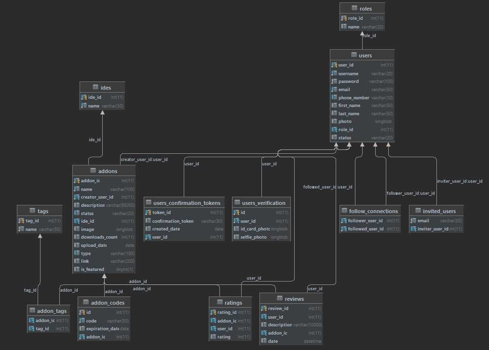
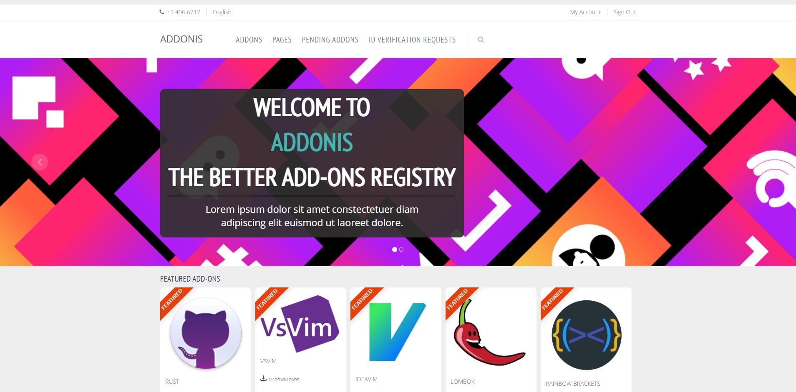
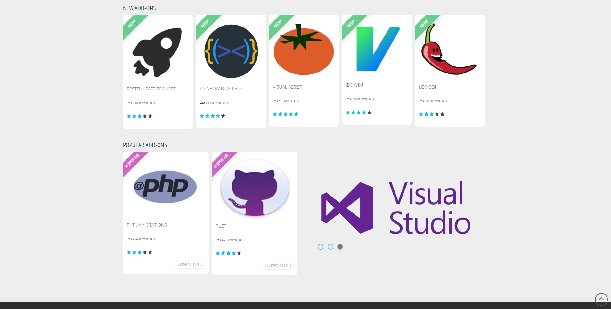
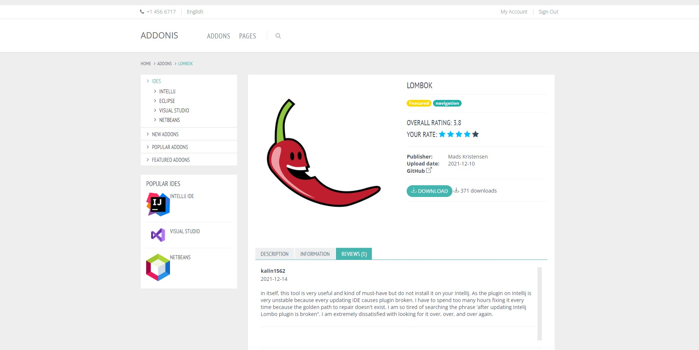
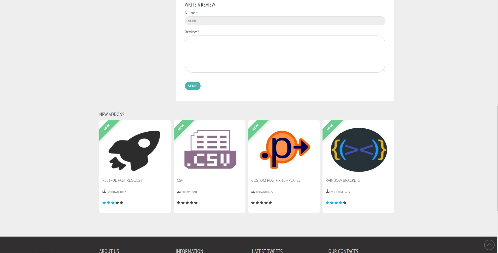
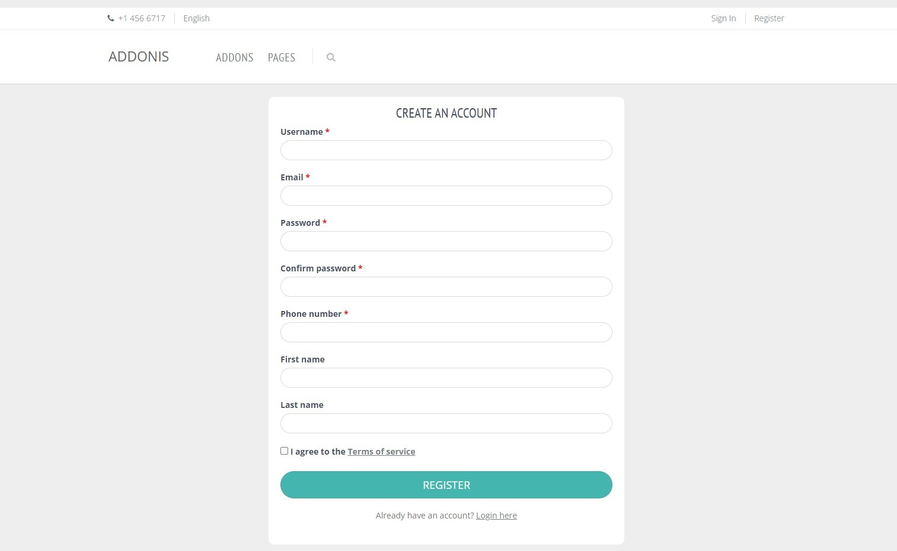
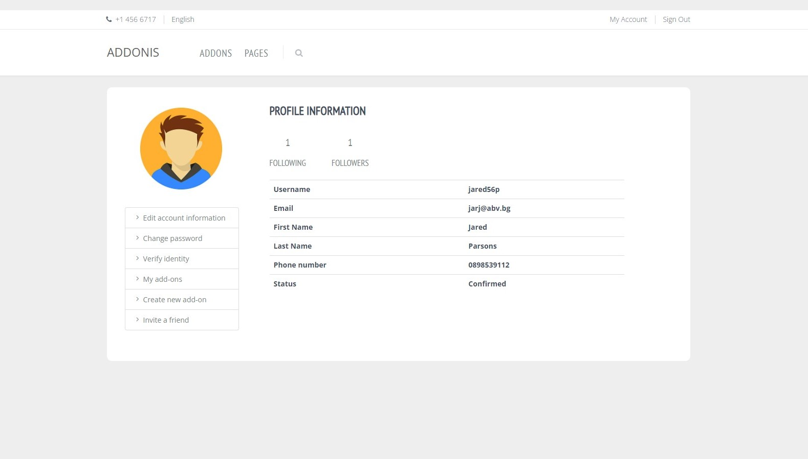
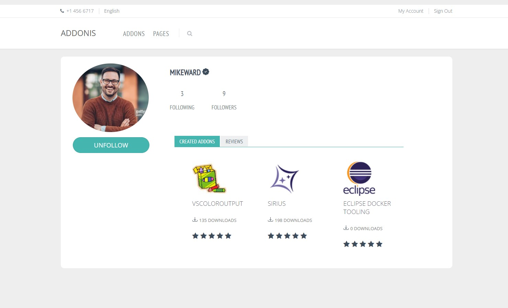

# Addonis - The better add-ons registry.

## Description

Addonis is an add-ons registry web application that allows users to manage and download addons for their IDEs.
Here is a list of some of the possible actions the application has for each of its three types of users:

**Anonymous users:**

- Login and register
- Browse lists of all/new/popular/featured add-ons
- Filter add-ons by name and IDE
- Sort addons by number of downloads, upload date and last commit date
- Download add-ons

**Registered users:**

After registering, the application sends a confirmation email to the user. After confirming their registration the users are enabled to:
- Manage their profiles
- Invite friends to the application via email
- Write reviews for all add-ons
- Rate all add-ons
- View profiles of other users
- Follow other users

Registered users can request identity verification by submitting a picture of their id card and a selfie. After the admin approves of their request, they can:
- Create/update drafts for new add-ons, visible only to them
- Create/update new add-ons. In order for an add-on to be created, the user is prompted to enter a verification code, sent to their email. After confirmation, the add-on is switched to "pending" status and could be posted to the system once an administrator approves it
- Delete their add-ons

**Admins:**

- See a list of all users, search them by phone number, username or email
- Block/unblock users. A blocked user is able to do everything as a normal user, except to create new and update current addons.
- Update/delete all add-ons
- Approve/decline pending add-ons
- Approve/decline user identity verification requests

## Tools & Technologies
Spring, Hibernate, Thymeleaf, Mockito, HTML, CSS, Bootstrap, MariaDB, Gradle

## Swagger API documentation
http://localhost:8080/swagger-ui/#/

## Database

## Application Screenshots
- Home page

- Single add-on page

- Register page

- My profile after email confirmation

- Profile of another, verified user

